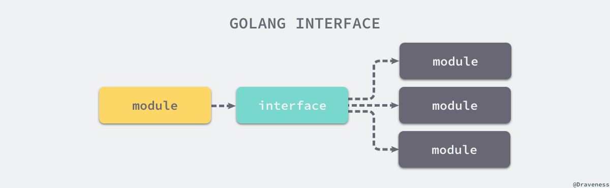

source link: [Go语言设计与实现](https://draveness.me/golang/docs/part2-foundation/ch04-basic/golang-function-call/)

## 函数调用
### 对比
C 语言和 Go 语言在设计函数的调用惯例时选择了不同的实现。C 语言同时使用寄存器和栈传递参数，使用 eax 寄存器传递返回值；而 Go 语言使用栈传递参数和返回值。我们可以对比一下这两种设计的优点和缺点：
  - C 语言的方式能够极大地减少函数调用的额外开销，但是也增加了实现的复杂度；
    - CPU 访问栈的开销比访问寄存器高几十倍3；
    - 需要单独处理函数参数过多的情况；
  - Go 语言的方式能够降低实现的复杂度并支持多返回值，但是牺牲了函数调用的性能；
    - 不需要考虑超过寄存器数量的参数应该如何传递；
    - 不需要考虑不同架构上的寄存器差异；
    - 函数入参和出参的内存空间需要在栈上进行分配；

Go 语言使用栈作为参数和返回值传递的方法是综合考虑后的设计，选择这种设计意味着编译器会更加简单、更容易维护。
1. 通过堆栈传递参数，入栈的顺序是从右到左，而参数的计算是从左到右；
2. 函数返回值通过堆栈传递并由调用者预先分配内存空间；

### 参数传递
传值和传引用两者的区别：
- 传值：函数调用时会对参数进行拷贝，被调用方和调用方两者持有不相关的两份数据；
- 传引用：函数调用时会传递参数的指针，被调用方和调用方两者持有相同的数据，任意一方做出的修改都会影响另一方。

Go 语言选择了传值的方式，无论是传递基本类型、结构体还是指针，都会对传递的参数进行拷贝。
- 传递结构体时：会拷贝结构体中的全部内容
- 传递结构体指针时：会拷贝结构体指针
- 整型和数组类型都是值传递的
- 如果数组的大小非常的大，这种传值的方式会对性能造成比较大的影响。在传递数组或者内存占用非常大的结构体时，我们应该尽量使用指针作为参数类型来避免发生数据拷贝进而影响性能。

```go
// 修改结构体指针是改变了指针指向的结构体，b.i 可以被理解成 (*b).i，也就是我们先获取指针 b 背后的结构体，再修改结构体的成员变量。
// 所以将指针作为参数传入某个函数时，函数内部会复制指针，也就是会同时出现两个指针指向原有的内存空间，所以 Go 语言中传指针也是传值。
type MyStruct struct {
	i int
    j int
}

func myFunction(ms *MyStruct) {
    ptr := unsafe.Pointer(ms)
    for i := 0; i < 2; i++ {
        c := (*int)(unsafe.Pointer((uintptr(ptr) + uintptr(8*i))))
        *c += i + 1
        fmt.Printf("[%p] %d\n", c, *c)
    }
}

func main() {
    a := &MyStruct{i: 40, j: 50}
    myFunction(a)
    fmt.Printf("[%p] %v\n", a, a)
}

$ go run main.go
[0xc000018180] 41
[0xc000018188] 52
[0xc000018180] &{41 52}
```

## 接口
接口的本质是引入一个新的中间层，调用方可以通过接口与具体实现分离，解除上下游的耦合，上层的模块不再需要依赖下层的具体模块，只需要依赖一个约定好的接口。

Go 语言中接口的实现都是隐式的，我们只需要实现 Error() string 方法就实现了 error 接口。Go 语言实现接口的方式与 Java 完全不同：
- 在 Java 中：实现接口需要显式地声明接口并实现所有方法；
- 在 Go 中：实现接口的所有方法就隐式地实现了接口；

### 数据结构
Go 语言根据接口类型是否包含一组方法将接口类型分成了两类：
1. 使用 runtime.iface 结构体表示包含方法的接口
```go
// 
type iface struct { // 16 字节
    tab  *itab
    data unsafe.Pointer
}
```
2. 使用 runtime.eface 结构体表示不包含任何方法的 interface{} 类型；
```go
// 它的结构也相对来说比较简单，只包含指向底层数据和类型的两个指针。
// Go 语言的任意类型都可以转换成 interface{}
type eface struct { // 16 字节
	_type *_type
	data  unsafe.Pointer
}
```

## 反射
reflect 实现了运行时的反射能力，能够让程序操作不同类型的对象1。反射包中有两对非常重要的函数和类型，两个函数分别是：
- reflect.TypeOf 能获取类型信息； 
- reflect.ValueOf 能获取数据的运行时表示；

Go 语言反射的三大法则3，其中包括：
1. 从 interface{} 变量可以反射出反射对象；
```go
package main

import (
	"fmt"
	"reflect"
)
// 使用 reflect.TypeOf 和 reflect.ValueOf 能够获取 Go 语言中的变量对应的反射对象。
func main() {
	author := "draven"
	fmt.Println("TypeOf author:", reflect.TypeOf(author))
	fmt.Println("ValueOf author:", reflect.ValueOf(author))
}

$ go run main.go
TypeOf author: string
ValueOf author: draven
```
2. 从反射对象可以获取 interface{} 变量； 
```go
v := reflect.ValueOf(1)
v.Interface().(int)
```
3. 要修改反射对象，其值必须可设置；
```go
func main() {
	i := 1
	v := reflect.ValueOf(&i) // 调用 reflect.ValueOf 获取变量指针；
	v.Elem().SetInt(10)      // 调用 reflect.Value.Elem 获取指针指向的变量
	fmt.Println(i)           // 调用 reflect.Value.SetInt 更新变量的值
}

$ go run reflect.go
10
```

## select
C 语言的 select 系统调用可以同时监听多个文件描述符的可读或者可写的状态，Go 语言中的 select 也能够让 Goroutine 同时等待多个 Channel 可读或者可写，在多个文件或者 Channel状态改变之前，select 会一直阻塞当前线程或者 Goroutine。

当我们在 Go 语言中使用 select 控制结构时，会遇到两个有趣的现象：
1. select 能在 Channel 上进行非阻塞的收发操作； 
2. select 在遇到多个 Channel 同时响应时，会随机执行一种情况；

### 非阻塞的收发
在通常情况下，select 语句会阻塞当前 Goroutine 并等待多个 Channel 中的一个达到可以收发的状态。但是如果 select 控制结构中包含 default 语句，那么这个 select 语句在执行时会遇到以下两种情况：
1. 当存在可以收发的 Channel 时，直接处理该 Channel 对应的 case；
2. 当不存在可以收发的 Channel 时，执行 default 中的语句；
```go
errCh := make(chan error, len(tasks))
wg := sync.WaitGroup{}
wg.Add(len(tasks))
for i := range tasks {
    go func() {
        defer wg.Done()
        if err := tasks[i].Run(); err != nil {
            errCh <- err
        }
    }()
}
wg.Wait()

select {
case err := <-errCh:
    return err
default:
    return nil
}
```

编译器在中间代码生成期间会根据 select 中 case 的不同对控制语句进行优化，这一过程都发生在 cmd/compile/internal/gc.walkselectcases 函数中，我们在这里会分四种情况介绍处理的过程和结果：
1. select 不存在任何的 case； 
> 空的 select 语句会直接阻塞当前 Goroutine，导致 Goroutine 进入无法被唤醒的永久休眠状态。
2. select 只存在一个 case； 
> 当 case 中的 Channel 是空指针时，会直接挂起当前 Goroutine 并陷入永久休眠。
3. select 存在两个 case，其中一个 case 是 default； 
> 非阻塞地执行收发操作
4. select 存在多个 case；

上述四种情况不仅会涉及编译器的重写和优化，还会涉及 Go 语言的运行时机制，我们会从编译期间和运行时两个角度分析上述情况。

## defer
Go 语言的 defer 会在当前函数返回前执行传入的函数，它会经常被用于关闭文件描述符、关闭数据库连接以及解锁资源。

## panic && recover
- panic 能够改变程序的控制流，调用 panic 后会立刻停止执行当前函数的剩余代码，并在当前 Goroutine 中递归执行调用方的 defer；
- recover 可以中止 panic 造成的程序崩溃。它是一个只能在 defer 中发挥作用的函数，在其他作用域中调用不会发挥作用；

## make && new
- make 的作用是初始化内置的数据结构，也就是我们在前面提到的切片、哈希表和 Channel；
- new 的作用是根据传入的类型分配一片内存空间并返回指向这片内存空间的指针；
```go
// make
slice := make([]int, 0, 100)
hash := make(map[int]bool, 10)
ch := make(chan int, 5)
// new
i := new(int)
var v int
i := &v
```
